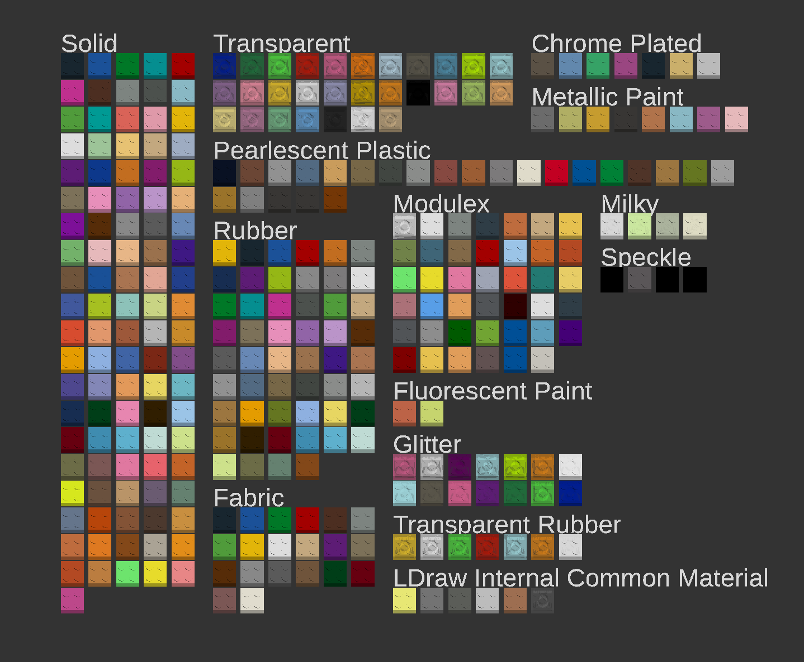

This is a library for OpenScad that lets you use the LDraw colour codes and names.

## Installation
Download [ldraw-colour.scad](https://github.com/Nexusnui/LDrawColoursForOpenScad/raw/master/ldraw-colours/ldraw-colours.scad) and place it into the OpenScad libraries folder or your project folder.  
(This library might be also be installable through the OpenScad library manager, when available)  
## Usage

### From Variable Names
Include:  
`include <ldraw-colours.scad>;`  
Then you can use ldraw colours like this:  
`color(LD_red)sphere(10);`  
There are two prefixes "LD_" and "LDe_". They followed by either a colour code or name.
For example "LD_4" and "LD_red" are the same colour. Colour names must be lower case.
The prefix "LDe" returns the edge colour of the LDraw colour.  
More about LDraw colours can be found in the [LDraw Colour Definition Reference](https://www.ldraw.org/article/547.html).

### From a function calls
Include:
`include <ldraw-colours_util>;`  
Then you can call it like this:  
`color(ldraw_rgb("4")sphere(10);`  
Or an edge colour like this:  
`color(ldraw_edge("4")sphere(10);`  
Both functions accept strings with either a colour code or a colour name. Colour names must be lower case.
Getting the colour through a function can be usefully when using the OpenScad customizer.

The colour values are from the LDConfig.ldr file included with the LDraw library available on [LDraw.org](https://ldraw.org)  
The colours are the ones present in the parts update 2025-09.  
LDraw™ is a trademark owned and licensed by the Estate of James Jessiman, which does not sponsor, endorse, or authorize this library.